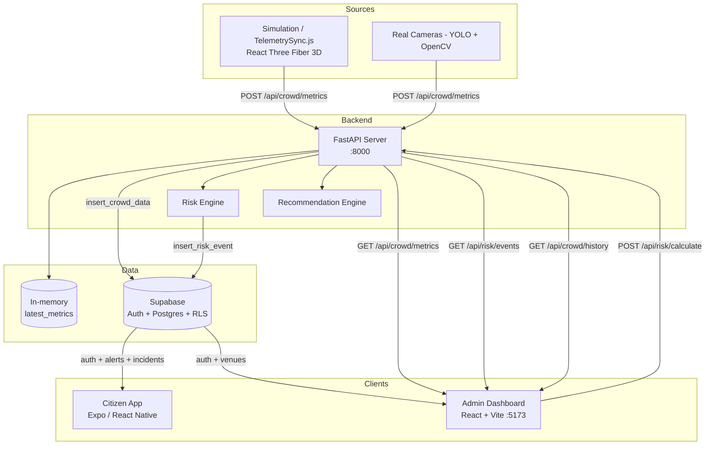

# CrowdShield – AI-Powered Crowd Management System

**Hackathon MVP** — AI early-warning system that turns reactive crowd monitoring into **predictive public safety**.

Crowd telemetry is generated by a **3D simulation**, ingested by a **FastAPI backend**, stored & secured in **Supabase**, visualized on a **live admin dashboard**, and pushed as **alerts to a citizen mobile app**.

---

## 📌 Overview

CrowdShield continuously monitors crowd density, movement speed, surges, and bottlenecks across zones of a venue, computes a **0–100 risk score**, and surfaces **level-based responses** (SAFE → WARNING → HIGH → CRITICAL) to both security operators and citizens.

**One line:** *Simulate → Analyze → Alert → Act.*

---

## 🎯 Key Features

- 🎮 **3D crowd simulation** (React Three Fiber) generating realistic telemetry
- 📊 **Real-time crowd monitoring** (live metrics, history, heatmaps)
- ⚠️ **AI risk engine** (0–100 score, 4 levels, explainable reasons)
- 🧠 **Recommendation engine** (level-gated operational actions)
- 🗺️ **Admin dashboard** (React + Vite) with live map + camera feed, alerts, telemetry panel, analytics
- 📱 **Citizen mobile app** (Expo) with alerts, safe routes, incident reporting
- 🔔 **Push notifications** via Expo Notifications
- 🔐 **Auth & RLS** via Supabase (roles: citizen / authority / admin)

---

## 🏗️ Architecture



### Data Flow (end-to-end)

```
Simulation tick (1/s) → per-zone metrics → POST /api/crowd/metrics (5 zones)
        → FastAPI validates (Pydantic) → upsert in-memory latest_metrics
        → insert into Supabase crowd_data (if migrations applied)
Risk Engine (density/speed/surge/bottleneck/flow_conflict) → 0-100 score + level + reasons
        → insert into Supabase risk_events (on level change only)
Dashboard polls (2s) → GET /api/crowd/metrics + /api/risk/events
        → renders live cards, map, camera feed, alert feed, telemetry
```

---

## 🧱 Tech Stack

| Layer | Technology |
| --- | --- |
| Simulation | React 18 + Vite 5 + React Three Fiber / drei / Three.js |
| Backend API | FastAPI + Uvicorn (Python 3.10+) |
| Data / Auth | Supabase (Postgres, Auth, Row Level Security) |
| Admin Dashboard | React 19 + Vite 8 + Tailwind CSS v4 + zustand + React Three Fiber |
| Mobile App | React Native + Expo SDK 54 + Expo Router + NativeWind |
| Notifications | Expo Notifications |
| Computer Vision (planned) | YOLO + OpenCV |

---

## 📁 Repository Layout

| Path | Purpose |
| --- | --- |
| `Server/` | FastAPI backend: API, risk engine, recommendations, Supabase persistence |
| `Simulation/` | 3D crowd simulation that streams telemetry to the Server |
| `Web/` | Admin dashboard (operator console) |
| `App/` | Citizen mobile app (Expo) |
| `App/db/migrations/` | Supabase SQL migrations (`0001_db_init.sql`, `0002_backend_persistence.sql`) |

---

## 🧠 Risk Engine

Defined in `Server/services/risk_engine.py`.

| Signal | Weight | Trigger |
| --- | --- | --- |
| High Crowd Density | 35 | `density > 0.00005` |
| High Movement Speed | 20 | `average_speed > 1.5` |
| Crowd Surge | 15 | `surge_detected == true` |
| Bottleneck | 10 | `bottleneck == true` |
| Flow Conflict | 10 | `flow_conflict == true` (opposing movement in a zone) |

**Levels:**

| Level | Score | Operator Response (`recommendation_engine.py`) |
| --- | --- | --- |
| SAFE | 0–30 | Situation normal, continue monitoring |
| WARNING | 31–60 | Increase CCTV monitoring, alert nearby security |
| HIGH | 61–80 | Deploy security team, control entry gate, broadcast warning |
| CRITICAL | 81–100 | Close gate G3, open exit E2, redirect crowd, call emergency team |

**Input keys:** `density`, `average_speed`, `surge_detected`, `bottleneck`, `flow_conflict`
**Output:** `{ "risk_score": int, "risk_level": "SAFE"|"WARNING"|"HIGH"|"CRITICAL", "reasons": string[] }`

> On the dashboard, risk levels map to **green (SAFE) / yellow (WARNING) / orange (HIGH) / red (CRITICAL)**.

---

## ⚙️ API Reference (FastAPI, port 8000)

| Method | Endpoint | Description | Params / Body |
| --- | --- | --- | --- |
| GET | `/` | Health message | — |
| GET | `/status` | Service status | — |
| GET | `/api/crowd/metrics` | Latest in-memory metrics | — |
| GET | `/api/crowd/history` | Crowd history from Supabase | `limit=50`, `zone_id=` |
| POST | `/api/crowd/metrics` | Ingest telemetry (persists to `crowd_data`) | `Metrics` JSON |
| GET | `/api/risk/events` | Latest risk events | `limit=50` |
| POST | `/api/risk/calculate` | Compute risk score + persist event | `Metrics` JSON |
| POST | `/api/recommendations` | Compute risk + get level-gated actions | `Metrics` JSON |

### `Metrics` payload (Pydantic model — `Server/models.py`)

```json
{
  "camera_id": "SIM_ZONE_A",
  "zone_id": "ZONE_A",
  "people_count": 84,
  "density": 0.0003,
  "speed": 0.4,
  "surge_detected": false,
  "bottleneck": false,
  "flow_conflict": false,
  "direction": "NORTH",
  "timestamp": "2026-08-09T12:34:56.789Z"
}
```

> Note: `POST /api/crowd/metrics` accepts `speed` (alias) and internally maps it to
> `average_speed` (`ConfigDict(populate_by_name=True)` + `validation_alias="speed"`),
> so the API also emits `average_speed`.

---

## 🗄️ Database (Supabase)

Run migrations in order in the **Supabase SQL Editor**:

1. `App/db/migrations/0001_db_init.sql` — schema + RLS + auto-profile trigger
2. `App/db/migrations/0002_backend_persistence.sql` — adds `surge_detected` / `bottleneck` columns and anon INSERT policies for backend persistence

**Tables:** `profiles`, `venues`, `crowd_data`, `risk_events`, `incidents`, `alerts`

**Note:** The anon key cannot run DDL — applying `0002` is required for live inserts
to work from the Server (see the *Blocked* note in Work State).

> **Known gap:** `flow_conflict` is consumed by the risk engine and posted by the
> simulation, but it is **not yet persisted** to `crowd_data` (the insert in
> `Server/db.py` omits it). A `0003` migration adding the column + an
> `insert_crowd_data` update would close this gap.

---

## 🚀 Getting Started

### 0. Prerequisites

- Python 3.10+
- Node.js 18+ (npm)
- A Supabase project (free tier) with URL + anon key

### 1. Backend (`Server/`)

```bash
cd Server
pip install -r requirements.txt
# create Server/.env
#   SUPABASE_URL=https://<project>.supabase.co
#   SUPABASE_ANON_KEY=<anon key>
uvicorn main:app --reload --port 8000
```

Swagger UI → `http://localhost:8000/docs`

> No `SUPABASE_URL`/key? The server still boots and the in-memory metrics +
> risk engine work — only DB persistence degrades gracefully.

### 2. Admin Dashboard (`Web/`)

```bash
cd Web
npm install
# create Web/.env
#   VITE_SUPABASE_URL=https://<project>.supabase.co
#   VITE_SUPABASE_ANON_KEY=<anon key>
#   VITE_API_URL=http://localhost:8000
npm run dev        # http://localhost:5173
npm run build      # production build
npm run lint       # eslint
```

### 3. Simulation (`Simulation/`)

```bash
cd Simulation
npm install
npm run dev        # http://localhost:3000
```

Streaming to the server is **off by default** (`TelemetrySync.js`). Enable it in
the simulation UI (toggle) so it starts posting each zone's telemetry to
`POST /api/crowd/metrics`. The sim streams **5 zones** (ZONE_A…ZONE_E) once per
tick, each with `density`, `speed`, `surge_detected`, `bottleneck`, and
`flow_conflict`. If the server is offline it retries with a **15-second backoff**
so the console stays clean.

### 4. Citizen App (`App/`)

```bash
cd App
npm install
# create App/.env
#   EXPO_PUBLIC_API_URL=http://<your-lan-ip>:8000
#   EXPO_PUBLIC_SUPABASE_URL=...
#   EXPO_PUBLIC_SUPABASE_ANON_KEY=...
npx expo start     # scan QR with Expo Go
```

> Expo SDK 54 — consult the versioned docs at
> `https://docs.expo.dev/versions/v54.0.0/` before changing Expo code.

---

## 🔐 Environment Variables (summary)

| Variable | Component | Required |
| --- | --- | --- |
| `SUPABASE_URL` | Server | Yes (falls back to default project) |
| `SUPABASE_ANON_KEY` | Server | Yes for persistence |
| `VITE_SUPABASE_URL` | Web | Yes |
| `VITE_SUPABASE_ANON_KEY` | Web | Yes |
| `VITE_API_URL` | Web | Yes (`http://localhost:8000`) |
| `EXPO_PUBLIC_API_URL` | App | Yes |
| `EXPO_PUBLIC_SUPABASE_URL` / `EXPO_PUBLIC_SUPABASE_ANON_KEY` | App | Yes for auth |

---

## 🎬 Demo Flow

```
1. Launch Server (uvicorn :8000)
2. Launch Simulation (:3000) → toggle streaming ON
3. Launch Dashboard (:5173) → login (Supabase auth) → dashboard
4. Simulation drives crowds in 5 zones → per-zone telemetry POSTed every second
5. Dashboard polls live metrics + risk events → cards/map/camera feed/alert feed update
6. Trigger a surge/bottleneck/flow-conflict in the simulation → risk_score climbs
   → CRITICAL alert (red) appears in dashboard + app
7. App user reports an incident / receives a push notification
```

---

## 🛣️ Roadmap / Production Notes

- **Real-time:** replace 2s polling with WebSocket/SSE + push
- **Ingestion:** decouple via message bus (Kafka / Redis Streams / SQS)
- **Time-series:** TimescaleDB/InfluxDB for `crowd_data` (aggregation + retention)
- **Config:** move venue/zones to a DB config table (currently hardcoded)
- **Vision:** wire YOLO + OpenCV camera pipeline as a telemetry source
- **Scaling:** N camera ingestors → bus → risk-engine workers → events + aggregates

---

## 🌟 Future Scope

- Digital twin simulation
- AI crowd prediction (ML on historical `crowd_data`)
- Voice dashboard
- Multilingual assistant

---

## 📄 License

MIT License

---

## 👨‍💻 Author

Built for hackathon innovation 🚀
Focus: **AI + Real-time systems + Public Safety**
